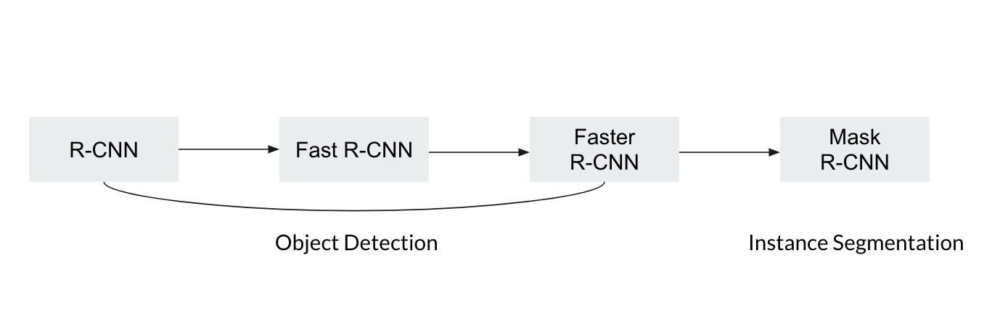
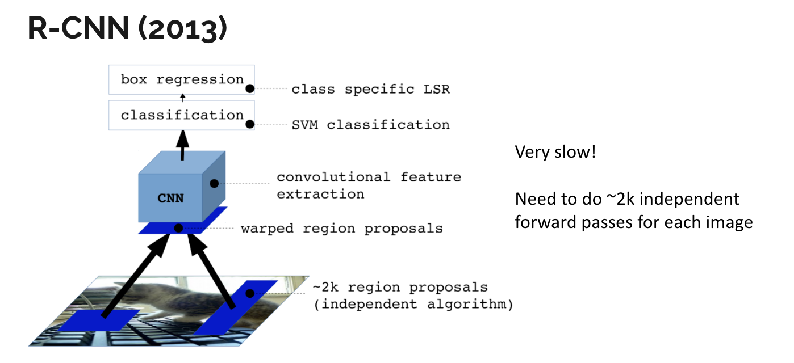
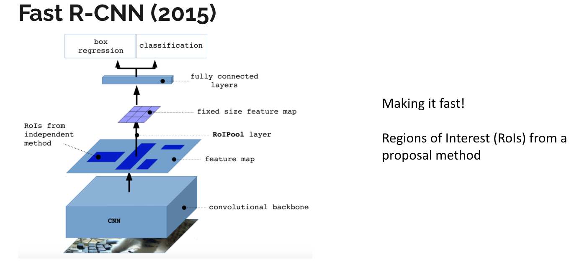
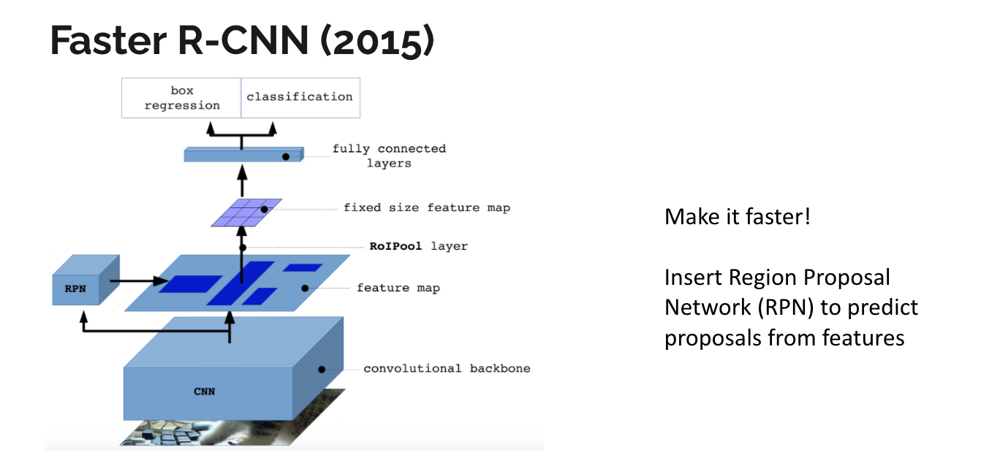
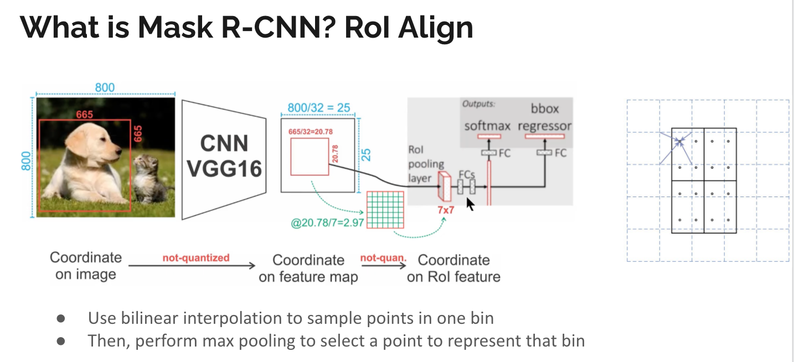
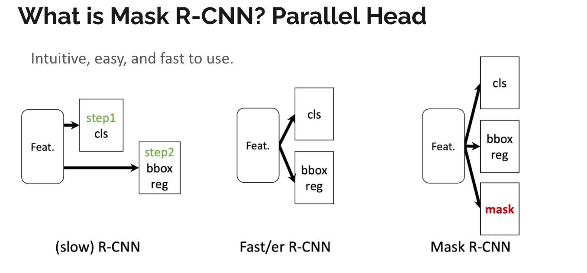
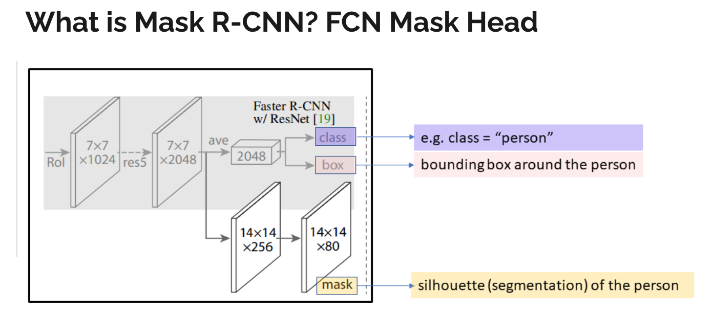
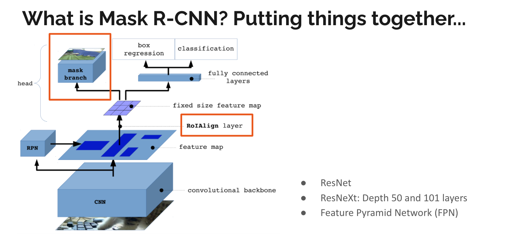
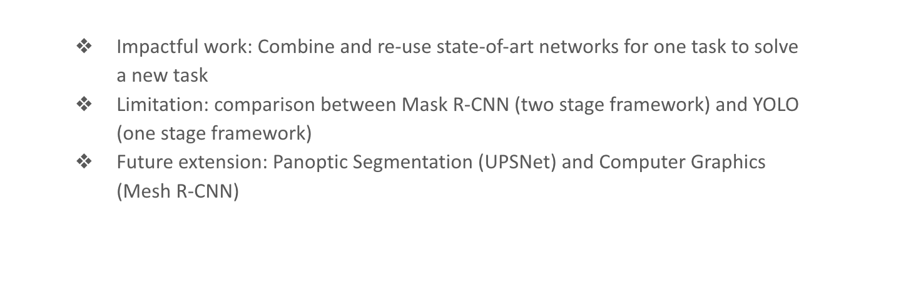

📖 Link to the Paper: [Mask R-CNN](https://openaccess.thecvf.com/content_ICCV_2017/papers/He_Mask_R-CNN_ICCV_2017_paper.pdf)

## The R-CNN Family

## Problem Statement

<b>Input</b>: Images with objects

<b>Output</b>: Correct masks of all objects in the image while also precisely segmenting each instance.

<b>Application</b>: Autonomous driving, medical imaging, human pose estimation, etc.

<b>Goal of this Mask R-CNN</b>: To create a meta-algorithm to support future research of instance segmentation, that has good speed/accuracy and is intuitive/easy-to-use.

## Main Contribution

The research problem in this paper is instance segmentation. Compared to object detection where a bounding box is determined per instance, instance segmentation predicts pixel-level segmentation for each instance, in addition to the object class. After the authors examine the prior work in object detection and semantic segmentation, they decide to take the best of both worlds and solve the instance segmentation problem by augmenting the Faster R-CNN model with a mask branch that is a small FCN. 

The main contribution of this paper is the proposal of Mask R-CNN, as a fast and easy-to-use network with great accuracy, for it to serve as a meta-algorithm and a solid foundation for future instance-level research. 

## Method

## What's good and what's not so good?

Mask R-CNN is an intuitive extension from Faster R-CNN with a few unique corrections for instance segmentation task, including RoIAlign and a parallel FCN mask head. RoIAlign is proposed to combat quantization from RoIPool to protect the pixel-to-pixel alignment. The authors argued by experiment results that decoupling segmentation from classification and bounding-box regression is preferred than the coupling of multiple tasks. Thus, Mask R-CNN adds a separate mask head to the Faster R-CNN network to predict a binary mask for each class independently. 

However, the authors didn’t give a formal proof of <b>why decoupling is more desirable than making masks</b> across classes compete against each other. I consider this a minor limitation of the paper. An implicit trade-off of the Mask R-CNN design is the <b>accuracy vs. speed balance</b>, since Mask R-CNN uses the Faster R-CNN network, it also inherent the speed limitation from it as a two-stage network. Compared to a single-stage network YOLO, Mask R-CNN is slower in the object detection task, but more accurate thanks to its a localization step that preserves the spatial coherence for the segmentation. 

Overall, this extension is intuitive, and it generates non-trivial improvement on multiple tasks including object detection, instance segmentation, and human pose estimation with the same framework. 

## Future Work

Mask RCNN is an influential paper, which has been cited 9714 times (Jan 2021). In my opinion, this paper not only advanced the state-of-art networks by its accuracy but more importantly, the vision behind it - <b>you don’t necessarily need a heavily-engineered complex structure to achieve a fundamental improvement</b>. 

As the authors did in this paper, observing how the achievement from a previous task (object detection and semantic segmentation in this case) can benefit a problem from an unsolved task (instance segmentation) and putting things together in a way that make sense (intuitive extension to include the mask and avoid quantization) can also produce great results. With the idea behind Mask R-CNN, we can extend even faster object detection networks to solve instance segmentation such as YOLO.

